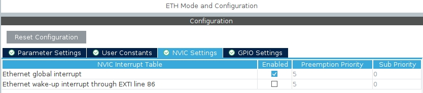
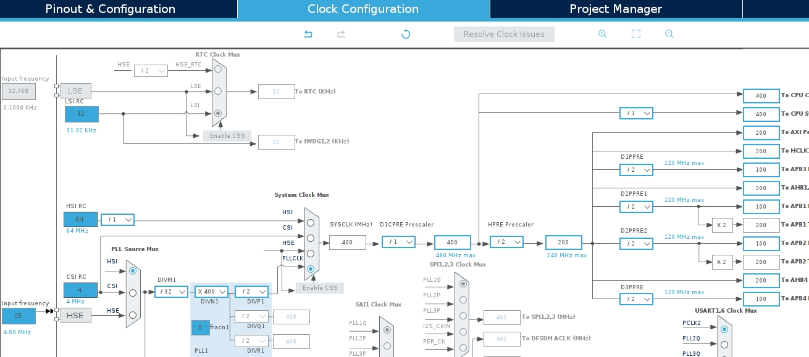
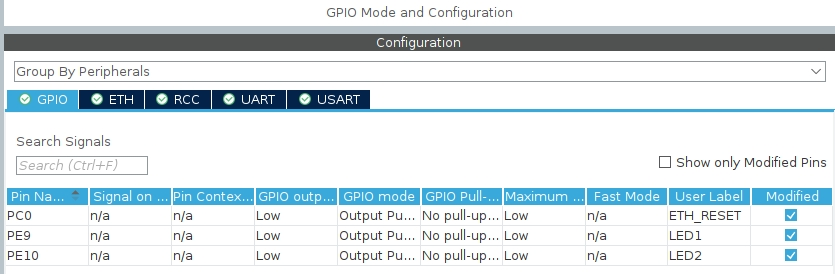

1. https://github.com/stm32-hotspot/STM32H7-LwIP-Examples
- In "ETH" tab,set Mode to RMII/MII
- In "ETH/NVIC Setting" tab,set Ethernet global interrupt to Enable

- Clock Configuration设置有误，会触发Error_Handler。需要以其示例代码去设置，正确设置如下图

- In "LwIP/Key options" tab set MEM_SIZE to 16360,set LWIP_RAM_HEAP_POINTER to 0x30020000
- if set RMII mode,enable reset io

2. 添加网卡复位代码 
https://blog.csdn.net/szccxy/article/details/134460146
```
/* USER CODE BEGIN PHY_PRE_CONFIG */
  // file name :ethernet.c 
  // reset code start
  HAL_GPIO_WritePin(ETH_RESET_GPIO_Port, ETH_RESET_Pin, GPIO_PIN_RESET);
  osDelay(55);
  HAL_GPIO_WritePin(ETH_RESET_GPIO_Port, ETH_RESET_Pin, GPIO_PIN_SET);
  osDelay(55);
  // reset code end  
/* USER CODE END PHY_PRE_CONFIG */
  /* Set PHY IO functions */
  LAN8742_RegisterBusIO(&LAN8742, &LAN8742_IOCtx);
```